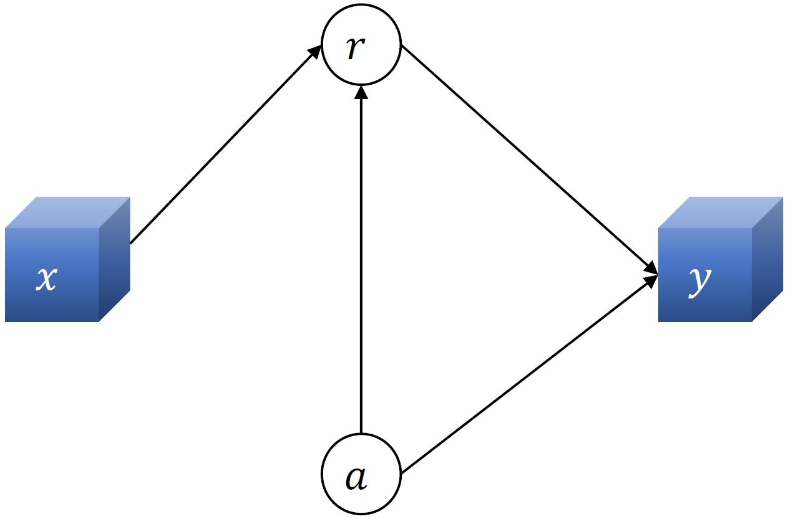
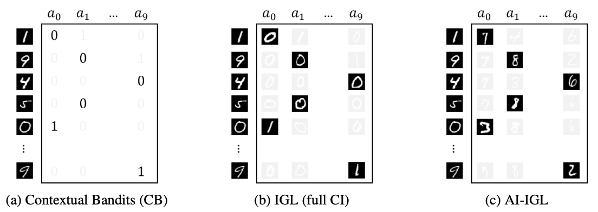
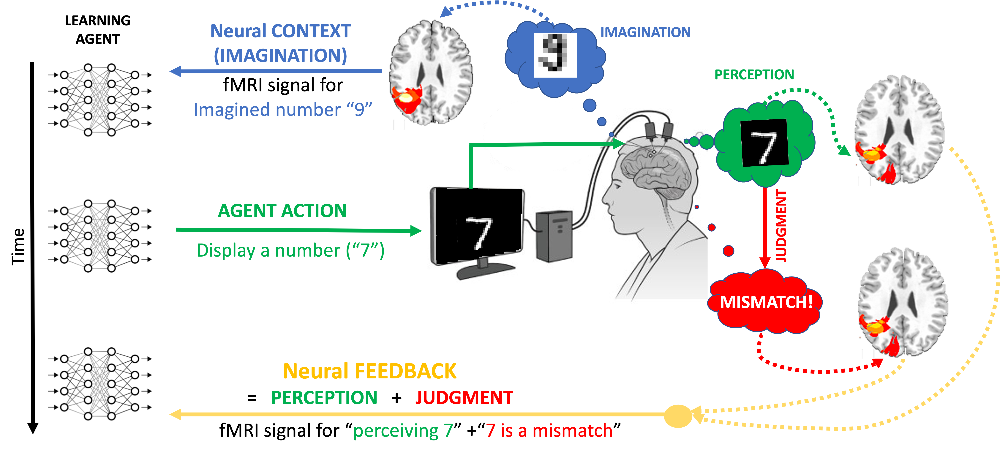

# Interaction-Grounded Learning with Action-Inclusive Feedback

This respository contains code for the following [paper](https://arxiv.org/pdf/2206.08364.pdf):
> T. Xie*, A. Saran*, D.J. Foster, L. Molu, I. Momennejad, N. Jiang, P. Mineiro, J. Langford.
Interaction-Grounded Learning with Action-Inclusive Feedback.
Neural Information Processing Systems (NeurIPS), November 2022. 

<!--  -->
<p align="center">
    
</p>

## MNIST Simulation


The code for this section has been tested with Python 3.7 and PyTorch 1.13.0. 

```
cd mnist
python mnist.py
```

## OpenML Simulations
The code for this section has been tested with pyvw 9.10.
```
cd openml
python data_download.py --do_first
jupyter nbconvert --to notebook --execute openml.ipynb --output openml.ipynb
```

## fMRI Simulation


The code for this section has been tested with brainiak, statsmodels 0.10.2. Download the [human fMRI data](https://dataspace.princeton.edu/handle/88435/dsp01dn39x4181) and save it in the `fMRI/data/` folder.

```
cd fMRI
python generate_signal_pattern.py
```

Generate data for 50 different seeds
```
python generate_igl_data.py --noise_weight=0.05 --seed=1
python generate_test_data.py --noise_weight=0.05 --seed=1
```

Test Full CI IGL and AI-IGL
```
python combine_data.py 
python fmri.py --noise_weight=0.05 --optimizer=adam --ifprint=True --old_igl
python fmri.py --noise_weight=0.05 --optimizer=adam --ifprint=True --igl
```

## Bibliography
If you find our work to be useful in your research, please cite:
```
@inproceedings{xie2022interaction,
  title={Interaction Grounded Learning with Action-Inclusive Feedback},
  author={Xie, Tengyang and Saran, Akanksha and Foster, Dylan and Molu, Lekan 
  and Momennejad, Ida and Jiang, Nan and Mineiro, Paul and Langford, John},
  booktitle={Advances in Neural Information Processing Systems (NeurIPS)},
  year={2022}
}
```
